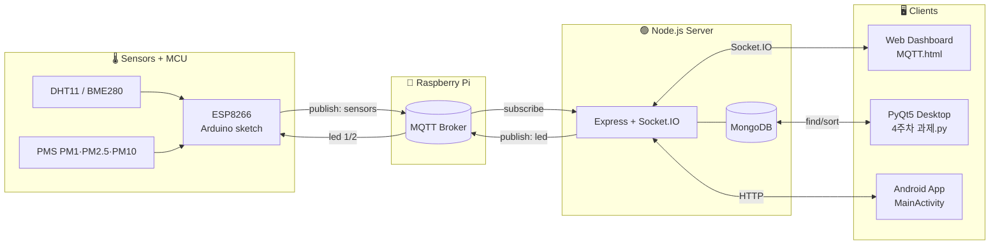

<div align="center">

# koss_iot

[English](README.md) | 한국어

### KOSS IoT 특강 — MQTT 기반 실내 환경 모니터링 시스템

라즈베리파이 · 아두이노(ESP8266) · Node/Express · MongoDB · PyQt5 · Android 를 한 흐름으로 연결한 IoT 실습 모음입니다.

<p>
  
  
  
  
  
</p>
<p>
  
  
  
  
  
</p>

<p>
  
  
  
</p>

</div>

---

## 목차

- [프로젝트 개요](#프로젝트-개요)
- [시스템 아키텍처](#시스템-아키텍처)
- [디렉터리 구조](#디렉터리-구조)
- [주차별 과제](#주차별-과제)
- [사용 하드웨어 & 센서](#사용-하드웨어--센서)
- [빠른 시작](#빠른-시작)
- [데모 영상](#데모-영상)
- [공기질 상태 아이콘](#공기질-상태-아이콘)
- [참고 사항](#참고-사항)
- [Author](#author)

---

## 프로젝트 개요

KOSS(Korea Open Source Software) IoT 특강에서 진행한 실습/과제 결과물을 모아둔 저장소입니다. 환경 센서로부터 수집한 데이터를 **MQTT**로 발행하고, 라즈베리파이가 브로커 역할을 하며, **Node/Express** 서버가 데이터를 받아 **MongoDB**에 적재합니다. 웹 페이지와 **PyQt5** 데스크톱 앱은 각각 Socket.IO·DB를 통해 실시간으로 시각화하고, 웹에서 LED를 ON/OFF 제어합니다.

핵심 흐름은 다음 한 줄로 요약됩니다.

> **Sensor → ESP8266(Arduino) → MQTT(Raspberry Pi) → Express → MongoDB → Web / PyQt**

---

## 시스템 아키텍처



---

## 디렉터리 구조

| 경로 | 설명 |
|---|---|
| `first/` | 1주차 — HTML/CSS 입문 실습 (`ex1.html` ~ `ex10.html`) |
| `third/` | 3주차 — Arduino 스케치 모음 (`1-DHT11_test.ino` ~ `6-sensor_mqtt/`) |
| `third/IOT_web/` | 3주차 — Node/Express/MQTT/MongoDB 웹 서버 |
| `pyqt/` | 4주차 — PyQt5 + matplotlib + pymongo 데스크톱 앱 |
| `pyqt/finedust/` | 미세먼지 상태 아이콘 (best/good/bad/worst.png) |
| `pyqt/Noto_Sans_KR/` | 그래프 한글 폰트 |
| `android/bootcamp-android-master/` | Android (Java) 앱 부트캠프 베이스 프로젝트 |
| `android/java_tutorials/` | Java 기초 튜토리얼 소스 |

<details>
<summary><b>Node 웹 서버 세부 구조</b></summary>

```
third/IOT_web/
├─ app.js              # Express + MQTT 구독자 + Socket.IO 게이트웨이
├─ models/sensors.js   # Mongoose 스키마 (tmp, hum, pm1, pm2, pm10, created_at)
├─ routes/devices.js   # POST /devices/led — LED ON/OFF REST 엔드포인트
├─ public/MQTT.html    # 실시간 모니터링 + LED 제어 UI
├─ package.json        # express · mongoose · mqtt · socket.io · dotenv
└─ .env.example        # MONGODB_URL 예시 (실제 값은 .env에 작성, 커밋 금지)
```

</details>

---

## 주차별 과제

<table>
  <tr>
    <th width="20%">주차</th>
    <th>주제</th>
    <th>주요 산출물</th>
  </tr>
  <tr>
    <td align="center"><b>1주차</b></td>
    <td>HTML/CSS 기초</td>
    <td><code>first/ex*.html</code> — 간단한 페이지·뮤직 플레이어 예제</td>
  </tr>
  <tr>
    <td align="center"><b>3주차</b></td>
    <td>MQTT 기반 센서 수집 + 웹 모니터링/제어</td>
    <td>
      ESP8266 스케치 6종 + <code>third/IOT_web</code> (Express, Socket.IO, MongoDB, MQTT)<br/>
      코드 라인별 주석은 각 소스 파일 안에 작성되어 있습니다.
    </td>
  </tr>
  <tr>
    <td align="center"><b>4주차</b></td>
    <td>PyQt5 데스크톱 미세먼지 모니터</td>
    <td>
      <code>pyqt/4주차 과제.py</code> — MongoDB 최신값을 1초마다 가져와 PM1/PM2.5/PM10 라이브 그래프 + 좋음/보통/나쁨/매우나쁨 아이콘 표시
    </td>
  </tr>
  <tr>
    <td align="center"><b>Android</b></td>
    <td>안드로이드 부트캠프 베이스</td>
    <td><code>android/bootcamp-android-master</code> — 단일 <code>MainActivity</code>, 인터넷 권한 + cleartextTraffic 활성, 센서 리스트 레이아웃 포함</td>
  </tr>
</table>

<details>
<summary><b>3주차 — 데이터 흐름 한눈에 보기</b></summary>

1. ESP8266이 DHT11/BME280/PMS 값을 읽어 `sensors` 토픽으로 publish
2. `app.js`가 MQTT 메시지를 받아 `created_at` 타임스탬프를 붙여 MongoDB `sensors` 컬렉션에 저장
3. 브라우저(`MQTT.html`)는 1초마다 `socket_evt_mqtt` 이벤트로 최신값을 폴링해 화면에 표시
4. LED 버튼은 두 가지 경로로 동작
   - **Socket 경로**: `socket_evt_led` → `client.publish("led", "1"|"2")`
   - **REST 경로**: `POST /devices/led` `{ "flag": "on"|"off" }` → 동일하게 MQTT publish
5. ESP8266 콜백이 페이로드 `1`/`2`를 받아 GPIO를 HIGH/LOW로 토글

</details>

<details>
<summary><b>4주차 — PyQt 앱 동작 요약</b></summary>

- `QMainWindow` 기반, 1초 간격 `dynamic_canvas.new_timer`로 그래프 갱신
- MongoDB에서 `_id` 역순 1건 조회 → PM1/PM2.5/PM10 추가, 6개 초과 시 가장 오래된 값 제거
- 한글 라벨은 `Noto_Sans_KR/NotoSansKR-Regular.otf` 로 렌더
- 환경 등급 판정 후 `pyqt/finedust/{best,good,bad,worst}.png` 아이콘 교체

</details>

---

## 사용 하드웨어 & 센서

| 하드웨어 | 역할 | 관련 파일 |
|---|---|---|
| Raspberry Pi | MQTT 브로커 (Mosquitto) | 코드 내 `mqtt://192.168.x.x` |
| ESP8266 (NodeMCU 등) | Wi-Fi MCU, 센서 publish + LED 구독 | `third/3-DHT11_mqtt_all/`, `third/6-sensor_mqtt/` |
| DHT11 | 온도/습도 | `third/1-DHT11_test.ino`, `third/2-DHT11_mqtt_pub.ino` |
| BME280 | 온/습/기압 | `third/4-bme280test.ino` |
| PMS 시리즈 | PM1 / PM2.5 / PM10 | `third/5-pms_test.ino` |
| LED | 원격 제어 데모 | ESP8266 GPIO `D5` |

---

## 빠른 시작

> 본 저장소는 강의용 실습 모음으로, 그대로 배포되는 단일 앱이 아닙니다. 각 모듈을 개별적으로 실행해 보세요.

### 1) 라즈베리파이 — MQTT 브로커

```bash
sudo apt-get install -y mosquitto mosquitto-clients
sudo systemctl enable --now mosquitto
hostname -I    # 브로커 IP 확인 → 클라이언트 코드에 반영
```

### 2) 아두이노(ESP8266) — 센서 publish

1. Arduino IDE에 ESP8266 보드, `PubSubClient`, `DHT sensor library` 설치
2. `third/3-DHT11_mqtt_all/3-DHT11_mqtt_all.ino` 열기
3. 다음 값을 본인 환경에 맞게 수정 후 업로드

```cpp
const char* ssid        = "<YOUR_WIFI_SSID>";
const char* wifi_pass   = "<YOUR_WIFI_PASSWORD>";
const char* mqtt_server = "192.168.x.x";   // 라즈베리파이 IP
```

### 3) Node 웹 서버

```bash
cd third/IOT_web
npm install
# 예시 파일을 복사한 뒤 .env의 MONGODB_URL을 본인 값으로 수정하세요. (.env는 커밋 금지)
cp .env.example .env
node app.js
# → http://localhost:3000/MQTT.html
```

엔드포인트:

| Method | Path | Body | 설명 |
|---|---|---|---|
| GET | `/MQTT.html` | – | 실시간 모니터링 + LED 컨트롤 UI |
| POST | `/devices/led` | `{ "flag": "on" \| "off" }` | LED 제어 (REST) |
| Socket | `socket_evt_mqtt` | `{}` | 최신 센서값 1건 요청/수신 |
| Socket | `socket_evt_led` | `{ "led": 1 \| 2 }` | LED 제어 (Socket) |

### 4) PyQt5 데스크톱 앱

```bash
cd pyqt
pip install PyQt5 matplotlib pymongo
python "4주차 과제.py"
```

> ⚠️ `4주차 과제.py` 의 `MongoClient(...)` 문자열은 **본인 MongoDB 연결 문자열로 교체**해야 합니다. 가능하면 환경변수로 분리하세요.

---

## 데모 영상

| 주차 | 영상 |
|---|---|
| 3주차 — 웹 모니터링 | https://user-images.githubusercontent.com/74747291/184285611-c67d4a21-e0c2-4578-b1e7-dd1a721ead90.mp4 |
| 3주차 — LED 제어 | https://user-images.githubusercontent.com/74747291/184285623-1a84cb06-d4c8-4aa6-8b80-33bee98c09dc.mp4 |
| 4주차 — PyQt 미세먼지 모니터 | https://user-images.githubusercontent.com/74747291/184285598-1d753f9e-ef82-4ea0-b223-08b1fd65c3c5.mp4 |

> GitHub README 에서는 위 링크를 클릭하면 인라인 비디오 플레이어로 재생됩니다.

---

## 공기질 상태 아이콘

PyQt 앱은 PM10/PM2.5 농도에 따라 4단계 아이콘을 갱신합니다.

<table>
  <tr>
    <td align="center"><br/><b>좋음</b><br/>PM10 ≤ 30 또는 PM2.5 ≤ 15</td>
    <td align="center"><br/><b>보통</b><br/>31–50 / 16–25</td>
    <td align="center"><br/><b>나쁨</b><br/>51–100 / 26–50</td>
    <td align="center"><br/><b>매우 나쁨</b><br/>≥ 101 / ≥ 51</td>
  </tr>
</table>

---

## 참고 사항

- 본 저장소는 **수업 실습 아카이브**입니다. 운영 배포용 코드가 아니며, 일부 자격증명·내부 IP·Wi-Fi SSID 등이 코드에 하드코딩되어 있을 수 있습니다. 재사용 시 반드시 본인 값으로 교체하고, 비밀값은 `.env` 또는 시크릿 매니저로 분리하세요.
- 강의 영상 데모는 발표 시점의 동작 모습을 보존하기 위해 그대로 유지했습니다.
- 각 소스 파일에는 학습용 한글 라인 주석이 함께 들어 있습니다.

---

## Author

<div align="center">

**김우현 ([@mrpc2003](https://github.com/mrpc2003))**

KOSS IoT 특강 과제 모음 · 2022

</div>
