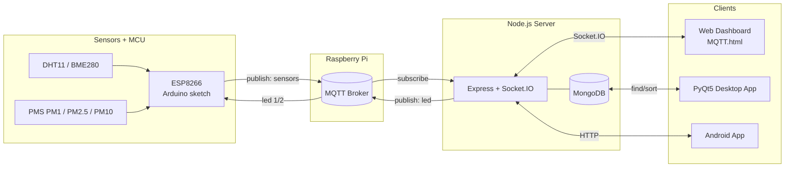

<div align="center">

# koss_iot

English | [한국어](README.ko.md)

### KOSS IoT Workshop — MQTT-Based Indoor Environment Monitoring System

An end-to-end IoT coursework collection connecting Raspberry Pi, Arduino (ESP8266), Node/Express, MongoDB, PyQt5, and Android.

<p>
  
  
  
  
  
</p>
<p>
  
  
  
  
  
</p>

<p>
  
  
</p>

</div>

---

## Table of Contents

- [Project Overview](#project-overview)
- [System Architecture](#system-architecture)
- [Directory Structure](#directory-structure)
- [Weekly Assignments](#weekly-assignments)
- [Hardware & Sensors](#hardware--sensors)
- [Getting Started](#getting-started)
- [Demo Videos](#demo-videos)
- [Air Quality Icons](#air-quality-icons)
- [Notes](#notes)
- [Author](#author)

---

## Project Overview

This repository contains lab exercises and assignments from the KOSS (Korea Open Source Software) IoT workshop. Environmental sensor data is published via **MQTT**, with a Raspberry Pi acting as the broker. A **Node/Express** server subscribes to the data and stores it in **MongoDB**. A web dashboard and a **PyQt5** desktop app visualize readings in real time, while the web UI also provides remote LED ON/OFF control.

The core data flow in one line:

> **Sensor → ESP8266 (Arduino) → MQTT (Raspberry Pi) → Express → MongoDB → Web / PyQt**

---

## System Architecture



---

## Directory Structure

| Path | Description |
|---|---|
| `first/` | Week 1 — HTML/CSS introductory exercises (`ex1.html` – `ex10.html`) |
| `third/` | Week 3 — Arduino sketches (`1-DHT11_test.ino` – `6-sensor_mqtt/`) |
| `third/IOT_web/` | Week 3 — Node/Express/MQTT/MongoDB web server |
| `pyqt/` | Week 4 — PyQt5 + matplotlib + pymongo desktop app |
| `pyqt/finedust/` | Air quality status icons (best/good/bad/worst.png) |
| `pyqt/Noto_Sans_KR/` | Korean font for graph labels |
| `android/bootcamp-android-master/` | Android (Java) bootcamp base project |
| `android/java_tutorials/` | Java basics tutorial sources |

<details>
<summary><b>Node Web Server Detail</b></summary>

```
third/IOT_web/
├─ app.js              # Express + MQTT subscriber + Socket.IO gateway
├─ models/sensors.js   # Mongoose schema (tmp, hum, pm1, pm2, pm10, created_at)
├─ routes/devices.js   # POST /devices/led — LED ON/OFF REST endpoint
├─ public/MQTT.html    # Real-time monitoring + LED control UI
├─ package.json        # express · mongoose · mqtt · socket.io · dotenv
└─ .env.example        # MONGODB_URL example (actual values go in .env, never committed)
```

</details>

---

## Weekly Assignments

<table>
  <tr>
    <th width="20%">Week</th>
    <th>Topic</th>
    <th>Key Deliverables</th>
  </tr>
  <tr>
    <td align="center"><b>Week 1</b></td>
    <td>HTML/CSS Basics</td>
    <td><code>first/ex*.html</code> — simple page and music player examples</td>
  </tr>
  <tr>
    <td align="center"><b>Week 3</b></td>
    <td>MQTT Sensor Collection + Web Monitoring/Control</td>
    <td>
      6 ESP8266 sketches + <code>third/IOT_web</code> (Express, Socket.IO, MongoDB, MQTT)<br/>
      Line-by-line comments are included in each source file.
    </td>
  </tr>
  <tr>
    <td align="center"><b>Week 4</b></td>
    <td>PyQt5 Desktop Fine-Dust Monitor</td>
    <td>
      <code>pyqt/4주차 과제.py</code> — polls MongoDB every second for PM1/PM2.5/PM10 live graph + air quality icon
    </td>
  </tr>
  <tr>
    <td align="center"><b>Android</b></td>
    <td>Android Bootcamp Base</td>
    <td><code>android/bootcamp-android-master</code> — single <code>MainActivity</code> with internet permission, cleartext traffic enabled, sensor list layout</td>
  </tr>
</table>

<details>
<summary><b>Week 3 — Data Flow at a Glance</b></summary>

1. ESP8266 reads DHT11/BME280/PMS values and publishes to the `sensors` topic
2. `app.js` receives the MQTT message, attaches a `created_at` timestamp, and saves to the MongoDB `sensors` collection
3. The browser (`MQTT.html`) polls the latest value every second via the `socket_evt_mqtt` event
4. LED buttons work through two paths:
   - **Socket path**: `socket_evt_led` → `client.publish("led", "1"|"2")`
   - **REST path**: `POST /devices/led` `{ "flag": "on"|"off" }` → same MQTT publish
5. The ESP8266 callback receives payload `1`/`2` and toggles GPIO HIGH/LOW

</details>

<details>
<summary><b>Week 4 — PyQt App Summary</b></summary>

- `QMainWindow`-based, refreshes graph every 1 second via `dynamic_canvas.new_timer`
- Queries MongoDB for the latest document (sorted by `_id` descending), appends PM1/PM2.5/PM10 values, drops oldest when exceeding 6 data points
- Korean labels rendered with `Noto_Sans_KR/NotoSansKR-Regular.otf`
- Updates air quality icon (`pyqt/finedust/{best,good,bad,worst}.png`) based on concentration level

</details>

---

## Hardware & Sensors

| Hardware | Role | Related Files |
|---|---|---|
| Raspberry Pi | MQTT Broker (Mosquitto) | Referenced as `mqtt://192.168.x.x` in code |
| ESP8266 (NodeMCU) | Wi-Fi MCU — sensor publish + LED subscribe | `third/3-DHT11_mqtt_all/`, `third/6-sensor_mqtt/` |
| DHT11 | Temperature / Humidity | `third/1-DHT11_test.ino`, `third/2-DHT11_mqtt_pub.ino` |
| BME280 | Temperature / Humidity / Pressure | `third/4-bme280test.ino` |
| PMS series | PM1 / PM2.5 / PM10 | `third/5-pms_test.ino` |
| LED | Remote control demo | ESP8266 GPIO `D5` |

---

## Getting Started

> This repository is a coursework archive, not a single deployable application. Run each module independently.

### 1) Raspberry Pi — MQTT Broker

```bash
sudo apt-get install -y mosquitto mosquitto-clients
sudo systemctl enable --now mosquitto
hostname -I    # Note the broker IP for client code
```

### 2) Arduino (ESP8266) — Sensor Publish

1. Install the ESP8266 board package, `PubSubClient`, and `DHT sensor library` in Arduino IDE
2. Open `third/3-DHT11_mqtt_all/3-DHT11_mqtt_all.ino`
3. Update the following values for your environment, then upload:

```cpp
const char* ssid        = "<YOUR_WIFI_SSID>";
const char* wifi_pass   = "<YOUR_WIFI_PASSWORD>";
const char* mqtt_server = "192.168.x.x";   // Raspberry Pi IP
```

### 3) Node Web Server

```bash
cd third/IOT_web
npm install
# Copy the example env file and fill in your MongoDB connection string (.env is git-ignored)
cp .env.example .env
node app.js
# → http://localhost:3000/MQTT.html
```

Endpoints:

| Method | Path | Body | Description |
|---|---|---|---|
| GET | `/MQTT.html` | – | Real-time monitoring + LED control UI |
| POST | `/devices/led` | `{ "flag": "on" \| "off" }` | LED control (REST) |
| Socket | `socket_evt_mqtt` | `{}` | Request/receive latest sensor reading |
| Socket | `socket_evt_led` | `{ "led": 1 \| 2 }` | LED control (Socket) |

### 4) PyQt5 Desktop App

```bash
cd pyqt
pip install PyQt5 matplotlib pymongo
python "4주차 과제.py"
```

> **Note:** Replace the `MongoClient(...)` connection string in `4주차 과제.py` with your own MongoDB URI. Prefer using an environment variable to keep credentials out of source code.

---

## Demo Videos

| Week | Video |
|---|---|
| Week 3 — Web Monitoring | https://user-images.githubusercontent.com/74747291/184285611-c67d4a21-e0c2-4578-b1e7-dd1a721ead90.mp4 |
| Week 3 — LED Control | https://user-images.githubusercontent.com/74747291/184285623-1a84cb06-d4c8-4aa6-8b80-33bee98c09dc.mp4 |
| Week 4 — PyQt Fine-Dust Monitor | https://user-images.githubusercontent.com/74747291/184285598-1d753f9e-ef82-4ea0-b223-08b1fd65c3c5.mp4 |

> Click the links above to play inline on GitHub.

---

## Air Quality Icons

The PyQt app updates a 4-level icon based on PM10/PM2.5 concentration:

<table>
  <tr>
    <td align="center"><br/><b>Good</b><br/>PM10 ≤ 30 or PM2.5 ≤ 15</td>
    <td align="center"><br/><b>Moderate</b><br/>31–50 / 16–25</td>
    <td align="center"><br/><b>Unhealthy</b><br/>51–100 / 26–50</td>
    <td align="center"><br/><b>Very Unhealthy</b><br/>≥ 101 / ≥ 51</td>
  </tr>
</table>

---

## Notes

- This repository is a **classroom lab archive**. It is not production-ready code. Some internal IPs and Wi-Fi SSIDs may be hard-coded in source files. Always replace them with your own values and store secrets in `.env` or a secret manager.
- Demo videos are preserved as recorded at the time of presentation.
- Source files include Korean inline comments for learning purposes.

---

## Author

<div align="center">

**Woohyun Kim ([@mrpc2003](https://github.com/mrpc2003))**

KOSS IoT Workshop Assignments · 2022

</div>
